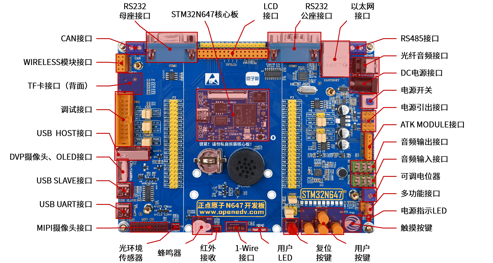
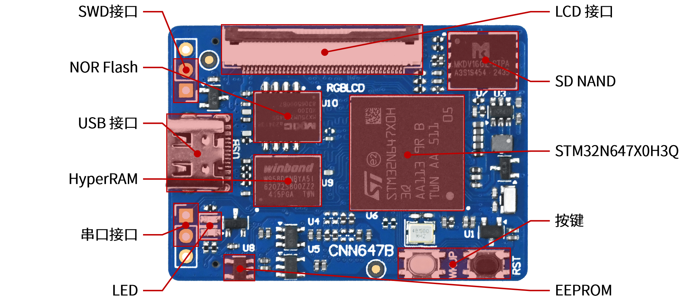

# MicroPython for ATK-DNN647

[](https://github.com/Mrpli/atk-dnn647-micropython/actions/workflows/ports_stm32.yml)

本项目是基于 [MicroPython](https://micropython.org) 官方最新版
专为正点原子 **ATK-DNN647** 开发板（STM32N657X0）定制的固件。

开发板具体信息，可查阅官方文档：[正点原子ATK-DNN647官方wiki](https://wiki.alientek.com/docs/Boards/STM32/DNN647/TOC)

| ATK-DNN647 拓展板 | 
|:-:|
|  |

| ATK-CNN647B 核心板 |
|:-:|
|  |

## 特性

- 外设支持：LED、按键、I2C4、SPI5、UART7、SD 卡、以太网、USB MSC/REPL
- 保留 MicroPython 标准库大部分功能
- 已验证：MIPI 摄像头、LTDC（实验性）

## 构建固件

## 环境准备

### 1. 安装 ARM 交叉编译工具链

ATK-DNN647 使用 Cortex-M55 (STM32N6)，需要 **GCC 14.3+**（Ubuntu 24.04 自带的 13.2 有已知 bug）。

从 Arm 官网下载：https://developer.arm.com/downloads/-/arm-gnu-toolchain-downloads

选择 **AArch32 bare-metal target (arm-none-eabi)** → 下载 `arm-gnu-toolchain-14.3.rel1-x86_64-arm-none-eabi.tar.xz`

```bash
# 解压并配置 PATH
sudo tar -xf arm-gnu-toolchain-14.3.rel1-x86_64-arm-none-eabi.tar.xz -C /opt/
echo 'export PATH=/opt/arm-gnu-toolchain-14.3.rel1-x86_64-arm-none-eabi/bin:$PATH' >> ~/.bashrc
source ~/.bashrc

# 验证
arm-none-eabi-gcc --version  # 应显示 14.3
```

### 2. 获取源码

```bash
git clone https://github.com/Mrpli/atk-dnn647-micropython.git
cd atk-dnn647-micropython
git submodule update --init
```

### 3. 编译 mpy-cross

```bash
make -C mpy-cross
```

### 4. 编译 ATK_DNN647 固件

```bash
cd ports/stm32
make BOARD=ATK_DNN647 submodules
make BOARD=ATK_DNN647
```

构建产物：`ports/stm32/build-ATK_DNN647/firmware.bin`

### 5. 编译 mboot 引导程序（可选，首次烧录需要）

```bash
make -C ports/stm32/mboot BOARD=ATK_DNN647
```

## 烧录

使用 STM32CubeProgrammer（SWD 接口）烧录：

```bash
# 烧录 mboot（外部 SPI Flash，仅首次需要）
	make -C mboot BOARD=ATK_DNN647 deploy-trusted

# 烧录主固件
STM32_Programmer_CLI \
    -c port=SWD mode=HOTPLUG ap=1 \
    -el <STM32CubeProgrammer>/bin/ExternalLoader/MX25UM51245G_STM32N6570-NUCLEO.stldr \
    -w ports/stm32/build-ATK_DNN647/firmware.bin 0x70080000 \
    -hardRst
```

也可使用 dfu-util 通过 USB DFU 模式烧录。

## 贡献

请阅读 [CONTRIBUTING.md](CONTRIBUTING.md) 了解如何贡献代码。

## 许可证

MIT License（与 MicroPython 一致）。

## 相关链接

- 原 MicroPython 官方仓库：<https://github.com/micropython/micropython>
- STM32N657X0 参考手册：<https://www.st.com/en/microcontrollers-microprocessors/stm32n657x0.html>
